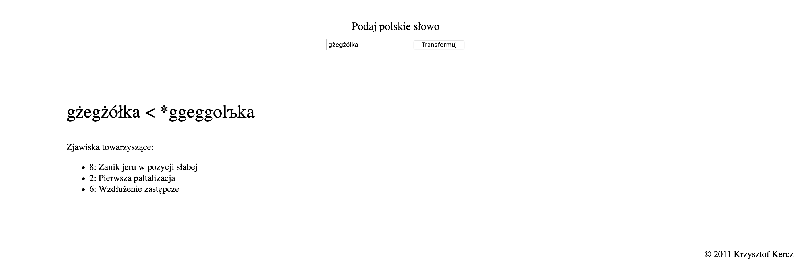

## Dobrava

This is a pet project of mine that I wrote back in 2011 when I was studying Polish philology.
It's basically an algorithm that given a Polish word, returns it's most probable form in 
the [Proto-Slavic](https://en.wikipedia.org/wiki/Proto-Slavic) language.   

## Technical notes

For some inexplicable reason I wrote this in PHP 
– that I don't even know and didn't know back then either –
I must have wanted to have an easy way of publishing it on the web.

All `.txt` files in the `data` directory
were created by pre-processing the [Morfologik](http://morfologik.blogspot.com/) dictionary.
Unfortunately, I no longer have scripts I used for that.  

## Usage

On MacOS, run the following command in the project directory to start a local PHP server:  

```
php -S localhost:9100
``` 

Navigate to https://localhost:9100 in the browser and use the web interface to play with the algorithm.

## Preview

